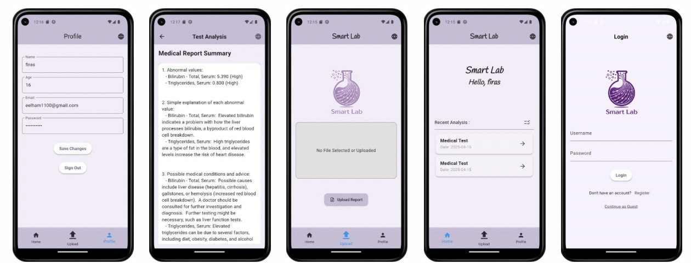

# SmartLab

# 

# SmartLab is an AI-powered mobile application built with Flutter and Dart, designed to simplify and interpret medical laboratory test results for general users. By combining OCR, AI, and user-friendly interfaces, SmartLab helps individuals better understand their health data and track medical progress effectively.

# 

# Features

# 

# OCR Integration:

# 

# Uses OCR.space API for text extraction from lab reports.

# 

# Planned enhancements with Google Vision AI for improved accuracy.

# 

# AI-Powered Interpretation:

# 

# Integrates Gemini AI to analyze extracted data.

# 

# Generates clear summaries and health improvement tips.

# 

# Health Tracking:

# 

# Stores historical test results for progress monitoring.

# 

# Provides insights into potential health risks.

# 

# Bilingual Support:

# 

# Dynamic language switching between English and Arabic.

# 

# Secure \& Scalable:

# 

# Local database integration for secure data storage.

# 

# Modular code structure enabling future features like disease prediction.

# 

# Screenshots

# 

# 

# Performance

# 

# Achieved ~92% accuracy in text extraction and interpretation.

# 

# Ensures reliable, user-friendly, and actionable health insights.

# 

# Future Enhancements

# 

# Disease prediction models based on lab results.

# 

# More advanced analytics dashboards.

# 

# Cloud-based storage with secure syncing across devices.

# 

# Integration with wearable health devices.

# 

# Usage

# 

# Upload or capture a medical report.

# 

# SmartLab extracts text using OCR.

# 

# AI interprets results, generates summaries, and suggests health tips.

# 

# Users can save results and track changes over time.

# 

# Switch between English and Arabic anytime.

# 

# 

